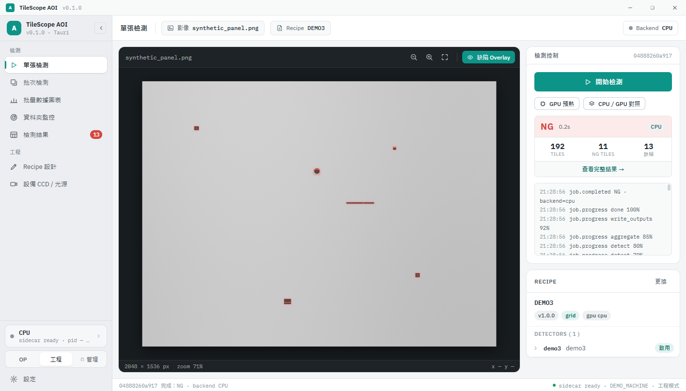
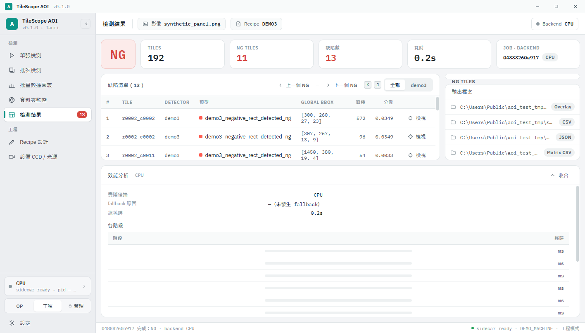
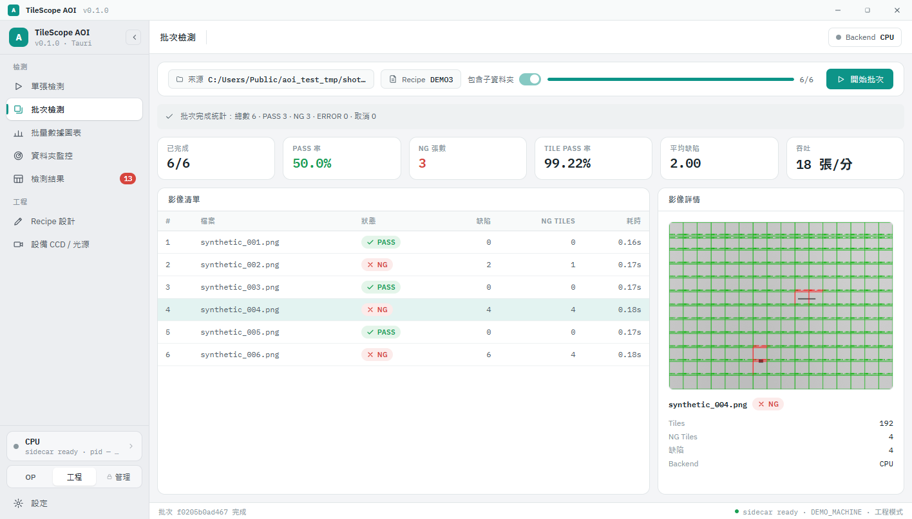
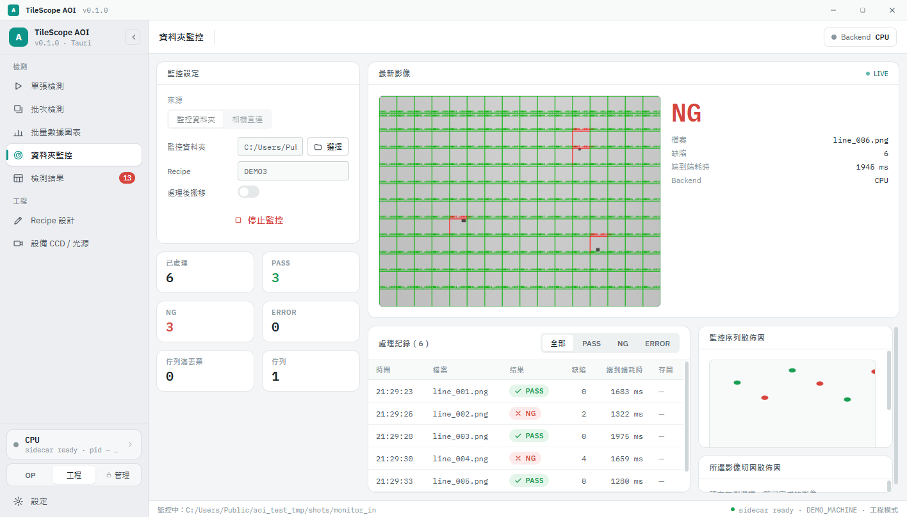
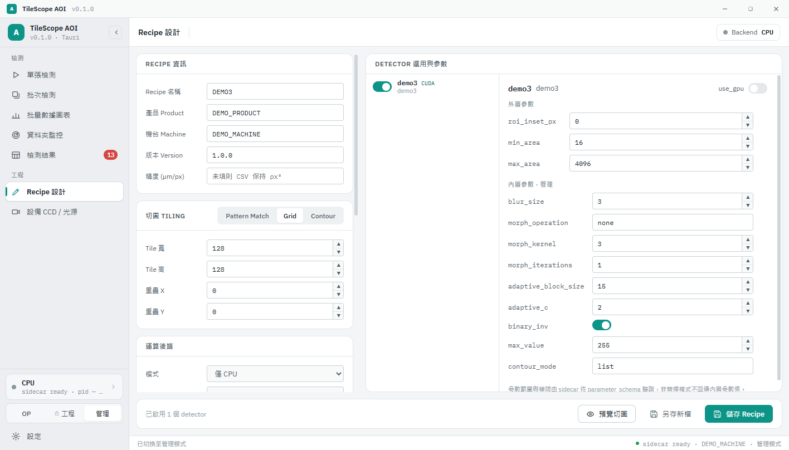

# TileScope AOI

以 Recipe 驅動的影像自動光學檢測（AOI）系統：把大圖切成 tile，交給可組合的傳統 CV／ONNX detector 判定 PASS／NG，輸出缺陷座標、疊圖與報表。CPU 是正確性基準，CUDA 為選用加速；同一套檢測核心可由 Tauri 桌面版、PySide6 Classic GUI 或 CLI 驅動。

隨附資料全部是人工生成的幾何影像與中性預設值（detector `demo1`–`demo12`、`recipes/DEMO*.yaml`），不含任何產品或產線校準。

## 功能

- **Recipe 驅動**：切圖（Pattern Match／Grid／Contour）、detector 組合、判定規則與輸出選項都寫在 YAML，由 `RecipeManager` 嚴格驗證。
- **Detector 架構**：每個 detector 宣告不可變的 `PreprocessPlan`，由共用的 CPU executor（OpenCV 參考實作）或 CUDA executor 執行；GPU 任一步失敗會讓整個 detector 回到 CPU 重跑，不混用部分結果。
- **CPU／CUDA 語意**：`gpu.mode` 為 `cpu`（不載入 CUDA）、`auto`（CUDA 不可用時完整回退 CPU）、`cuda`（嚴格，失敗即報錯）。介面上的 backend 標示只依實際執行結果。
- **桌面版（主要 GUI）**：Tauri 2 + React 前端，Rust 宿主管理 Python sidecar；單張檢測、批次與數據圖表、資料夾監控、結果與效能分析、Recipe 設計、執行環境狀態。
- **權限**：OP／工程／管理三種模式；參數依 `outer`／`inner` 分組，非管理模式不會收到內層參數值，工程模式儲存時保留隱藏值。
- **設備（選用）**：線掃 CCD 相機（Sapera LT）、LSI-8181 米輪、PCIe-1730 Sensor 中繼、RS-232 光源；缺 SDK 或硬體時程式照常啟動並顯示原因與錯誤碼（[錯誤碼](docs/device-error-codes.md)）。

## 畫面

以下截圖皆為桌面版搭配真實 sidecar 的實際檢測結果（合成影像、DEMO3 Recipe、CPU）。

| 單張檢測 | 檢測結果 |
| --- | --- |
|  |  |
| **批次檢測** | **資料夾監控** |
|  |  |

Recipe 設計（管理模式可見內層參數；工程模式只看到外層參數）：



## 架構

```
React (WebView2) ──invoke/event──▶ Rust host (Tauri 2) ──stdio JSON-RPC──▶ Python sidecar ──▶ core / detectors / devices ──ctypes──▶ CUDA DLL
```

| 目錄 | 職責 |
| --- | --- |
| `desktop/` | Tauri 桌面版：`src-tauri/`（sidecar 生命週期、事件轉送、asset scope）、`src/`（畫面、API 層、瀏覽器 mock） |
| `aoi_sidecar/` | 不依賴 Qt 的 JSON-RPC 服務：工作排程、Recipe 權限過濾、預覽、設定、設備探測、`--smoke-test` |
| `core/` | pipeline、Recipe、切圖、彙總、報表、GPU session 與 preprocess plan |
| `detectors/` | 各 detector 的特徵、幾何篩選與缺陷 metadata |
| `devices/` | 選用取像硬體的介面、模擬器與廠商綁定（無 Qt） |
| `gpu/` | CUDA C ABI v1、kernels、建置與驗證工具 |
| `gui/` | TileScope AOI Classic（PySide6），遷移期間保留 |
| `packaging/` | 所有 PyInstaller spec 與建置腳本 |

Sidecar 協定只傳指令、事件與檔案路徑，不以 JSON 傳像素；同一時間只跑一個工作，取消會在資源釋放後才回報。完整契約見 [AGENT.md](AGENT.md)。

## 快速開始

需求：Windows 10/11 x64、CPython 3.12（`requirements.lock.txt`），桌面版另需 Node.js 20+ 與 Rust stable（MSVC）。

```powershell
py -3.12 -m venv env
.\env\Scripts\python.exe -m pip install -r requirements.lock.txt

# 產生示範影像並以 CLI 檢測（PASS exit code 0，NG 為 2）
.\env\Scripts\python.exe tools/demo_dataset.py --output outputs_validation/demo_dataset
.\env\Scripts\python.exe main.py --image outputs_validation/demo_dataset/shapes.png --recipe recipes/DEMO3.yaml --output outputs_validation/demo_cli

# 桌面版（開發模式，會自動啟動 sidecar）
cd desktop; npm ci; npm run tauri dev

# Classic GUI
.\env\Scripts\python.exe main.py --gui
```

> 專案路徑含非 ASCII 字元時，`vite build` 會在 rollup 階段崩潰；請在 ASCII 路徑建置前端（安裝檔腳本會自動處理）。執行 unittest 時請把 `TEMP`／`TMP` 設為 ASCII 目錄。

## 示範偵測器

| ID | 示範功能 |
| --- | --- |
| demo1 | 局部背景與 CNR 候選分析 |
| demo2 | 自適應反相輪廓 |
| demo3 | 反相矩形輪廓 |
| demo4 | 圓形輪廓 |
| demo5 | 白色像素比例 |
| demo6 | 自適應輪廓 |
| demo7 | 多邊形輪廓 |
| demo8 | 反相多邊形 |
| demo9 | 多邊形與選用屏蔽 |
| demo10 | 合成雙框尺寸與間距 |
| demo11 | 固定 PASS／NG／ERROR 的流程測試 |
| demo12 | YOLOX 測試圖與固定 ONNX fixture（不代表檢測準確度） |

預設值的唯一來源是 `detectors/demo_defaults.py`。新增 detector 的規則（CPU 參考、plan cache、fallback 與等價測試）見 [AGENT.md](AGENT.md)。

## 驗證與打包

```powershell
.\env\Scripts\python.exe -m unittest discover -s tests
.\env\Scripts\python.exe -m aoi_sidecar --smoke-test
cd desktop; npm run lint
cd desktop\src-tauri; cargo test; cargo clippy

# 桌面版安裝檔（凍結 sidecar → smoke test → NSIS，含 WebView2 離線安裝）
.\packaging\scripts\build_desktop.ps1 -Version 0.1.0
```

測試涵蓋 CPU 參考等價、缺 DLL／舊 DLL／GPU 失敗的回退路由、PASS／NG 與缺陷 metadata、權限與 Recipe 往返、sidecar 協定與工作生命週期。沒有 GPU 的機器只能做 CPU、fake DLL 與靜態檢查；CUDA 編譯與 RTX 3090 實機驗收另列於 [Todo.md](Todo.md)。

## AI 協作開發

這個專案以 AI 協作的方式開發，分工與規則都放在 repo 裡：

- **契約**：[AGENT.md](AGENT.md) 是所有 agent 共用的工程契約（CPU/GPU 語意、權限、設備、驗證流程）；[CLAUDE.md](CLAUDE.md)、[HERMES.md](HERMES.md) 是各工具的入口。
- **Skills**：`codex-skills/` 與 `.claude/skills/` 是同步維護的專案 skills，涵蓋收尾驗證與推送、detector 開發、CUDA 驗證、桌面版開發、發布與週報。
- **分工**：主導模型負責需求解讀、架構、任務拆解、審查與合併；實作交給在獨立 git worktree 中工作的 worker 模型（DeepSeek）或 `aoi-coder` subagent，也可經 `llm-delegate` MCP（`.claude/mcp/`）委派。
- **審查關卡**：worker 交回的 diff 一律由主導模型審查並自行重跑驗證，不採信 worker 的自我回報；發現問題就附具體描述退回修正。桌面版遷移期間攔下的例子包括：未分類參數未預設隱藏、backend 標示誤讀權限模式、同步命令阻塞主執行緒、重啟時舊 reader 覆寫新程序狀態。

## 授權與來源

本專案以 [PolyForm Noncommercial 1.0.0](LICENSE) 授權：個人、研究、教育等非商業用途可使用與修改，商業使用需另行取得授權。第三方元件依各自授權，見 [THIRD_PARTY_NOTICES.md](THIRD_PARTY_NOTICES.md)；來源紀錄見 [docs/source-provenance.md](docs/source-provenance.md)。工作清單見 [Todo.md](Todo.md)。
